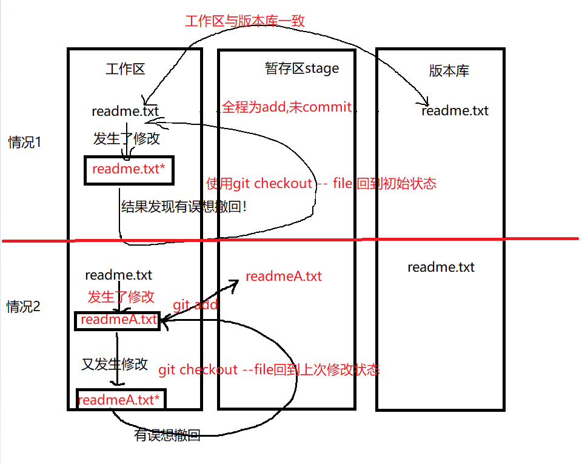

# Git彻底从入门到入土

---

## 1、Git初始化

### 1.1、开始 -> Git Bash,输入以下


`````tex
$ git config --global user.name "Your Name"
$ git config --global user.email "email@example.com"
`````

### 1.2、新建本地仓库

````tex
$ mkdir learngit //新建learngit文件夹
$ cd learngit	//进入learngi文件夹
$ pwd	//显示路径
/Users/michael/learngit
--------------------------------------
$ git init //文件夹转为git仓库
Initialized empty Git repository in /Users/michael/learngit/.git/
````

==PS：本地仓库和文件夹有本质区别，当该文件夹进行git init生成.git版本库后即为本地仓库。.git文件夹就是版本库（默认隐藏，使用ls -ah查看）==

### 1.3、添加文件到版本库

==PS:Git只会追踪文本文件（不含.doc）的改动，建议同一utf-8编码==

举例

#### 1.3.1、新建readme.txt，并添加到learngit目录下

````tex
Git is a version control system.
Git is free software.
````

#### 1.3.2、```git add```添加到暂存区

```tex
$ git add readme.txt
```

#### 1.3.3 、```git commit```提交到版本库

```tex
$ git commit -m "wrote a readme file"
[master (root-commit) eaadf4e] wrote a readme file
 1 file changed, 2 insertions(+)
 create mode 100644 readme.txt
```

==PS:```git add file1 file2 file2...```其后面可以add许多文件，但是commit会一次提交，相当于把暂存区内容全部清空并输入到版本库==


## 2、Git版本管理

### 2.1、修改与更新

#### 2.1.1、修改readme.txt文件
#### 2.1.2、```git status```查看工作区文件与分支进行对比

````tex
$ git status
On branch master
Changes not staged for commit:
  (use "git add <file>..." to update what will be committed)
  (use "git checkout -- <file>..." to discard changes in working directory)
	modified:   readme.txt
no changes added to commit (use "git add" and/or "git commit -a")
````

#### 2.1.3、```git diff```查看发生了什么修改

```tex
$ git diff readme.txt 
diff --git a/readme.txt b/readme.txt
index 46d49bf..9247db6 100644
--- a/readme.txt
+++ b/readme.txt
@@ -1,2 +1,2 @@
-Git is a version control system.
+Git is a distributed version control system.
 Git is free software.
```


````tex
file未add前、未commit前；
	git status显示fileUnTracked
Untracked files:
  (use "git add <file>..." to include in what will be committed)
        example.txt
----------------------------------------------------
file在add后，
	git status显示
Changes to be committed:
  (use "git restore --staged <file>..." to unstage)
        new file:   example.txt
-----------------------------------------------------
file在commit后，清空暂存区
	status显示干净。
nothing to commit, working tree clean
-----------------------------------------------------
file又发生修改！
	status显示发送改变但未暂存：
Changes not staged for commit:
  (use "git add <file>..." to update what will be committed)
  (use "git restore <file>..." to discard changes in working directory)
        modified:   example.txt
	
````

### 2.2、版本回退

#### 2.2.1、```git log```查看历史提交记录

````tex
commit了多次，使用git log
$ git log
commit 1094adb7b9b3807259d8cb349e7df1d4d6477073 (HEAD -> master)
Author: Michael Liao <askxuefeng@gmail.com>
Date:   Fri May 18 21:06:15 2018 +0800

    append GPL

commit e475afc93c209a690c39c13a46716e8fa000c366
Author: Michael Liao <askxuefeng@gmail.com>
Date:   Fri May 18 21:03:36 2018 +0800

    add distributed

commit eaadf4e385e865d25c48e7ca9c8395c3f7dfaef0
Author: Michael Liao <askxuefeng@gmail.com>
Date:   Fri May 18 20:59:18 2018 +0800

    wrote a readme file
````

==信息太多，使用git log --pretty=oneline，只显示commit版本号==

#### 2.2.2、```git reset```版本回退```append GPL->add distributed```

表示方法：```HEAD^```表示上一个版本，```HEAD^^```表示上上个版本，```HEAD~100```表示上100个版本。

```git reset --hard {<HEAD> or <commit id>}```

```tex
$ git reset --hard HEAD^
HEAD is now at e475afc add distributed
```

回退后，查看```git log```

```tex
$ git log
commit e475afc93c209a690c39c13a46716e8fa000c366 (HEAD -> master)
Author: Michael Liao <askxuefeng@gmail.com>
Date:   Fri May 18 21:03:36 2018 +0800

    add distributed

commit eaadf4e385e865d25c48e7ca9c8395c3f7dfaef0
Author: Michael Liao <askxuefeng@gmail.com>
Date:   Fri May 18 20:59:18 2018 +0800

    wrote a readme file
```

只是版本回退，但是append GPL版本还在，可使用```git reset --hard 1094a```返回未来某版本。

当找不到版本号时，使用```git reflog```查看记录

```tex
$ git reflog
e475afc HEAD@{1}: reset: moving to HEAD^
1094adb (HEAD -> master) HEAD@{2}: commit: append GPL
e475afc HEAD@{3}: commit: add distributed
eaadf4e HEAD@{4}: commit (initial): wrote a readme file
```


### 2.3、工作区与暂存区

#### 2.3.1、工作区

实际就是```learngit```文件夹下面除```.git```文件夹的部分。

#### 2.3.2、版本库

```.git=暂存区stage + 分支```


需要提交的文件修改通通放到暂存区，然后，一次性提交暂存区的所有修改。

`git add`命令实际上就是把要提交的所有修改放到暂存区（Stage），`git commit`执行就可以一次性把暂存区的所有修改提交到分支。一旦提交后，如果你又没有对工作区做任何修改，那么工作区就是“干净”的：

==PS:只有经过add和commit后的修改才能被版本库记录==，```git diff HEAD -- <file>```可以查看工作区与版本库中最新版本的区别。

### 2.4、撤销修改

#### 2.4.1、撤销修改

在工作区修改的文件发现有误时，使用```git checkout -- file```丢弃工作区修改。分以下两种情况



#### 2.4.2、撤销暂存区的```git add```

使用```git reset HEAD file```将暂存区的指定文件撤销。


#### 2.4.3、撤销版本库的```git commit```

使用版本回退

### 2.5、删除文件

工作区的文件直接使用```rm file```即可删除

工作区删除后，版本库会与其不一致，使用```git status```告诉哪些被删除。出现两种选择：确实从版本库删除和误删恢复。


==PS:注意：从来没有被添加到版本库就被删除的文件，是无法恢复的！==

## 3、远程仓库

### 3.1、绑定代码托管平台

1、创建SSH Key

```tex
$ ssh-keygen -t rsa -C "youremail@example.com"
回车默认即可
pwd查看路径
.ssh文件夹
|-id_rsa：私钥
|-id_rsa.pub:公钥
```

2、代码管理平台的SSH Keys页面输入```id_rsa.pub```文件内容，并添加即可

### 3.2、添加远程库

1、代码管理平台新建```repo```

2、本地库关联远程库

```tex
git remote add origin git@github.com:用户名/仓库名.git
```

3、本地库推送远程库

```tex
$ git push -u origin master
Counting objects: 20, done.
Delta compression using up to 4 threads.
Compressing objects: 100% (15/15), done.
Writing objects: 100% (20/20), 1.64 KiB | 560.00 KiB/s, done.
Total 20 (delta 5), reused 0 (delta 0)
remote: Resolving deltas: 100% (5/5), done.
To github.com:michaelliao/learngit.git
 * [new branch]      master -> master
Branch 'master' set up to track remote branch 'master' from 'origin'.
```

以后只要本地库```commit```,就可以使用```$ git push origin master```推送远程库。

### 3.3、删除远程库

1、```git remote -v```查看已关联远程库

```tex
$ git remote -v
origin  git@github.com:michaelliao/learn-git.git (fetch)
origin  git@github.com:michaelliao/learn-git.git (push)
```

2、根据名字删除

```tex
$ git remote rm 远程库名如：origin

```

### 3.4、仓库克隆

```tex
$ git clone git@github.com:用户名/仓库名.git
Cloning into 'gitskills'...
remote: Counting objects: 3, done.
remote: Total 3 (delta 0), reused 0 (delta 0), pack-reused 3
Receiving objects: 100% (3/3), done.
```


## 4、分支管理

#### 4.1、创建和合并分支

1、创建并切换到分支

```tex
$ git checkout -b 分支名
等价于：$ git branch 分支名
		$ git checkout 分支名
或使用新switch命令
$ git switch -c 分支名
```

2、查看当前分支

```tex
$ git branch
* dev
  master
```

3、切换分支

```tex
$ git checkout 分支名
Switched to branch 'master'
或使用新switch命令
$ git switch 分支名
```

4、合并特定分支到当前分支

```tex
$ git merge 分支名
Updating d46f35e..b17d20e
Fast-forward（快进模式）
 readme.txt | 1 +
 1 file changed, 1 insertion(+)
```

5、删除分支

````tex
$ git branch -d 分支名
Deleted branch dev (was b17d20e).
````


#### 4.2、解决冲突

分支出现的原因在于：两次分支原本应该相同的内容发生了差异，而这种差异在保存时只能二选一，因此需要解决冲突！

解决办法：

````tex
git status		//查看冲突的文件
cat file		//查看具体冲突的情况
修改file使其保持一致
git add file	//添加冲突要暂存区
git commit -m "mesag"//提交本次修改
git merge 分支名 //合并分支
git log	--graph	//查看分支合并情况
git branch -d 分支名//删除分支

````


#### 4.3、分支管理策略

```git merge 分支```会启用```Fast forward```模式，该模式会丢失分支信息。强制禁用该模式下，Git就会在merge时生成一个新的commit，==这样，从分支历史上就可以看出分支信息==。


#### 4.4、Bug分支

场景，正在dev分支上的工作区产生部分文件修改操作，需要临时去master分支上修改Bug，

##### 4.4.1、```git stash```临时存储工作区代码

需要临时去切换分支，但工作区的代码还没提交怎么办？

==注意！工作区发生的未提交的修改，都必须在提交后后才能去切换分支！==

```tex
git status	//显示修改
git stash	//存储工作区的修改到临时区
```

这样，工作区就算是干净了，可以进行修复Bug操作！

##### 4.4.2、Bug修复

```tex
1、git switch master			//切换到master分支
2、git switch -c issue-101	//创建并切换到issue-101分支
3、修改Bug部分，然后add&commit //在该分支上提交修改
4、git switch master			//切换回主分支
5、git merge --no-ff -m "merged bug fix 101" issue-101
							//合并issue-101分支到master分支
6、git branch -d issue-101	  //删除分支
```

Bug修复完毕，回到dev分支。

##### 4.4.3、dev分支现场恢复

```tex
git status 		//会显示该工作区干净
git stash list	//显示stash列表
两种恢复策略：
	1、git stash apply stash_id //恢复但保留临时区相关内容
	2、git stash pop	stash_id //恢复的同时会删除临时区相关内容
可以后面加编号，恢复指定的stash
```

##### 4.4.4、dev上的Bug修复

同样的Bug在dev修复，相当于复制一下master分支上的Bug修复操作。合并修复到到当前分支。

```tex
$ git branch
* dev
  master
$ git cherry-pick 4c805e2 //找到Bug修复号，复制操作即可。
[master 1d4b803] fix bug 101
 1 file changed, 1 insertion(+), 1 deletion(-)
```

### 4.5、Feature分支

当需要添加实验性质的特性时，需要新建一个分支，当要丢弃一个没有被合并过的分支，可以通过`git branch -D <name>`强行删除。

### 4.6、多人协作

查看远程库信息使用```git remote```和```git remote -v```

推送分支使用```git push origin 分支名```,不是所有分支都要推送。

当其他人也在同一远程仓库推送提交时，此时你也推送，则需要先```git pull```拉取推送（记得之前要stash工作区），然后再```git push origin <branch-name>```

多人协作的工作模式通常是这样：

1. 首先，可以试图用`git push origin <branch-name>`推送自己的修改；
2. 如果推送失败，则因为远程分支比你的本地更新，需要先用`git pull`试图合并；
3. 如果合并有冲突，则解决冲突，并在本地提交；
4. 没有冲突或者解决掉冲突后，再用`git push origin <branch-name>`推送就能成功！

如果`git pull`提示`no tracking information`，则说明本地分支和远程分支的链接关系没有创建，用命令`git branch --set-upstream-to <branch-name> origin/<branch-name>`。

### 4.7、Rebase操作

当分支杂乱无章时，可以使用`git rebase`使得提交变为直线。

## 5、标签管理

标签相当于commit id的简化。

步骤：

```tex
1、切换需要打标签的分支：
	git branch
	git switch 分支
2、打标签：
	git tag 标签名
3、查看所有标签
	git tag
4、标签补打
	git tag 标签名 commit_id
5、查看标签信息
	git show 标签名
6、创建带说明的标签，用-a指定标签名，-m指定说明文字：
	$ git tag -a v0.1 -m "version 0.1 released" 1094adb
7、删除标签
	git tag -d 标签名
8、推送标签
	git push origin 标签名
9、一次性推送全部尚未推送到远程的本地标签
	git push origin --tags
10、删除已推送到远程的标签
	1、先从本地删除
		git tag -d 标签名
	2、远程删除
		git push origin :refs/tags/标签名	
```


## 6、自定义Git

1、git显示醒目颜色，使用`git config --global color.ui true`

2、忽略文件使用`.gitignore`

3、命令简化

```tex
git config --global alias.简化词 原词
git config --global alias.st status
$ git config --global alias.co checkout
$ git config --global alias.ci commit
$ git config --global alias.br branch
//撤销修改
$ git config --global alias.unstage 'reset HEAD'
$ git unstage test.py
//配置显示最后一次提交
$ git config --global alias.last 'log -1'
$ git last
//特性化显示提交
git config --global alias.lg "log --color --graph --pretty=format:'%Cred%h%Creset -%C(yellow)%d%Creset %s %Cgreen(%cr) %C(bold blue)<%an>%Creset' --abbrev-commit"
```

4、配置Git时加`--global`是为了针对当前用户起作用，若不加仅对当前仓库起作用。配置文件放在.git/config文件中，当前用户的Git配置文件在.gitconfig中。

## 7、平台&软件

### 7.1、GitHub

```tex
1、克隆仓库
	git clone git@github.com:用户名/仓库名.git
```

### 7.2、Gitee

```tex
1、在SSH中输入.ssh/id_rsa.pub内容完成添加Key
2、本地关联远程仓库：
	git remote add origin git@gitee.com:用户名/仓库名.git
3、然后就可正常的push和pull
4、若使用git remote add出错
git remote add origin git@gitee.com:liaoxuefeng/learngit.git
fatal: remote origin already exists.
说明本地已关联origin数据库，点击git remote -v查看
说明关联了GitHub的origin仓库
5、删除已有的GitHub远程库
	git remote rm origin
6、一个仓库关联多个远程库
	1、先删除已关联名为origin的远程库
	git remote rm origin
	2、先关联GitHub远程库，起名github
	git remote add github git@github.com:michaelliao/learngit.git
	3、再关联Gitee远程库,起名gitee
git remote add gitee git@gitee.com:liaoxuefeng/learngit.git
```


## 8、总结


## 参考文献

### 1.[Git教程 - 廖雪峰的官方网站 (liaoxuefeng.com)](https://www.liaoxuefeng.com/wiki/896043488029600)

### 2.[Git可视化练习：Learn Git Branching](https://learngitbranching.js.org/?locale=zh_CN)

